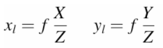
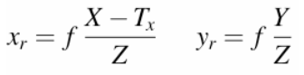
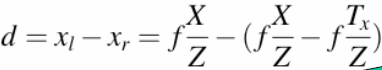

Farklı açıdan çekilmiş iki fotoğraf lazım.

Aynı eksen etrafında döndürülmüş olması da gerekiyor.

Farklı noktalardan çekilmiş olması lazım. Bu farklı pozisyonlar insanın iki gözüne denk geliyor.

### Disparity
Farklı yerden çekilmiş iki fotoğrafta aynı noktaların farklı yerlerde olmasına `disparity` deniliyor.

Her bir noktanın diğer görüntüdeki dengini bulsak ve aralarındaki dengini çıkarsak noktayla arasındaki bulalım. Her pixel için elimize bir tane sayı geçecek. O sayıdan oluşan görüntü oluşturursam o zaman `disparity` resmini elde ederim. `Disparity`'de pixel ne kadar parlaksa o kadar yakındır.

`Disparity` görselinde sıfır olan yerler, diğer resimde orası görünmüyor. Yani `occlusion` var.

`Stereo`'da `occlusion` olacaktır. `Occlusion` ne kadar fazlaysa iş o kadar zordur.

Aynı noktadan çekilen fotoğraflarda `occlusion` hiç olmaz ancak o zamanda derinlik elde edilmez. Bu sebeple `occlusion`'u çözmemiz lazım.

1, 2, 3, 4 noktaları görüntüde aynı yere düşerç Teorik olarak sadece bir görüntüye bakarak bir noktanın derinliğini bulmak mümkün değil.

Gerçek dünyada p noktasının üzerinde düşecek sonsuz tane nokta var! Bu noktaların gerçek konumunu bulmak için başka noktadan bakmamız lazım.

# İşte Stereo!

Üçgenleme yöntemi ile çözüyoruz. Haritacılar bu işle çok uğraşıyorlar.

### Parallax:
İki gözün farklı görmesi ve `occlusion`'lar oluşturması.

### Vanishing Point:
Paralel giden paralellerin perspektifte birleştiği nokta.

## Julesz Random-Dot Experiment
Cisimleri algılarken:
- Vanishing point
- Perspektif
- Cisimlerin büyüklüğü küçüklüğü
önemli ama iki görüntü arasında birbirine denk gelen noktaların denkleştirilmeside insan için önemli.

## STEREOGRAM

İki kamera arasında `Tx` kadar fark var.

`Stereo`'da `Tx`'e `baseline` diyoruz.

Diyelim sol kamera için `x1`, `y1` pozisyonuna düşüyor. Peki sağ kamera için?

Sağ kamera için

`y` ekseninde aynı kalır. `Baseline` nedeniyle değişen `x` olacak.

Bu şekilde kamerayı sağa kaydırmak yerine gerçek dünyadaki noktayı sola kaydırmış olduk. Eğer böyle yaparsak iki kamera birbirinin tıpatıp aynısı oluyor sadee birisi gerçek dünya ile konuşurken `-Tx` kadar çıkartmak gerekli.

Biz en başından beri `disparity` peşindeyiz.

Burada birbirine denk gelen noktada `y`'ler aynı `x`'ler farklı;

### Sol kamera

### Sağ kamera

### Stereo Disparity

> `Tx = baseline` iki kamera arasındaki uzaklık.

Bu eşitlik bir noktanın derinliği hakkında oluşuyor.

`d`'yi sıfıra götürelim sağ ve sol görüntü üzerinde nokta aynı yerde demektir. `d` sıfır olduğu zaman sonsuza gidiyor.

Bu seferde `d`'yi büyütelim. `d`'yi ne kadar büyütürsek `Z` o kadar küçülüyor. Kameranın dibine kadar geliyor.

`Tx` küçültelim; `Tx` sıfır olduğu zaman `d` ne oluyor?

`d` her zaman için sıfır olacak. `Tx` sıfır olduğu durumda derinlikten bahsedemeyiz. Derinlik için `Tx (baseline)` olması lazım, yoksa derinlik bulunmaz.

Mesela bazı hayvanlarda `central projection` aynı yerde, yani iki gözde aynı yerde. Aynı yerde olunca derinliği bulamayız.

Eğer elde ettiğimiz görüntüleri birleştirip bir panoroma oluşturacaksak o zaman `Tx=0` olması lazım. Derinlikle alakalı yok. Derinlik olursa dikiş yapamıyoruz. Tam üst üste oturmuyor.

`Yr` ve `Yl` arasındaki farkın sıfır çıkmasının sebebi nedir? \
Sebebi kamerayı sadece x ekseninde hareket ettirdik.

Kamerayı y ekseninde de hareket ettirirsek orada da fark elde ederiz.

Bu farklılaşma sürekli olarak bir doğru üzerinde oluyor.

`P` noktasına denk gelebilecek tüm noktalar, sağ görüntüde bir doğru üzerinde olmalı.

Yani `x`, `y`'e değişebilir ancak `disparity` sadece bir doğru üzerinde oluyor. Bir doğru üzerindeki farklılaşma. Dolayısıyla `stereo`'da arama problemi tek boyutlu bir problem `P` noktasını sağ görüntü üzerinde ararken tüm görüntü üzerinde aramıyoruz, bir doğru üzerinde arıyoruz. Buna `epipolar constraint` deniliyor.

> Derinlik ve `stereo disparity` ters orantılıdır.

İnsanda `Tx=63mm`, `Tx` değeri diğer değerlerle uyumlu ise sorun yok. 

`f`'yi ihmal edelim.

Örneğin:

d1=63/10 (6 pixel)

d2=63/60 (1 pixel)

d3=63/10,000

d4=63/15,000

`d3` ve `d4` yaklaşık 0 pixel!

`Z` ile `Tx` birbirine benzeye sayılarsa stereo işe yarıyor. `Z` **çok büyük** sayılarsa işe yaramıyor.

Bu durumda insan 1.2 metre sonra çokta derinlik alamıyor. Peki insan derinlik algısını nasıl alıyor?
`Occlusion`'lardan alıyor, cisimlerin büyüklüklerinden alıyoruz, `vanishing point`'lerden alıyoruz.

# EPIPOLAR GEOMETRY

`P` noktasının yerini değiştirdiğimizde

`ep` ve `e'p'` doğruları yer değişecek ancak `e` ve `e'` değişmeyecek, neden?

Cevap: `Baseline` olduğu için sadece kameralar yer değiştirince değişir.

`O` ve `O'` kameralarımızın merkezleri
`e` ve `e'` epipoldür.
`l` ve `l'` ise epipolar lines.

`Transation` iki kamera arasındaki uzaklık.

İki kamera arasında `T` var. Birde `R` yani `rotation` var. `Rotation`'u da işin içine koymamız gerekiyor.

 vektörünü  koordinat sistemi cinsinden açıklamak için elimdeki `p'`'nü rotate etmek gerekir.

![p.[tx (Rp')]](https://render.githubusercontent.com/render/math?math=p.%5Btx%28Rp%27%29%5D)

Burada rotation matrisi 3x3 matrisdir.

> Hatırlatmak isterim ki 12 bilinmeyeni olan `projection matrisi` idi.

Rotation marrisi içinde 9 sayı var ancak içerisinde 3 bilinmeyen var. x, y, ve z etrafında dönme.

`Rp'` ifadesinde `R` 3x3 rotation matris ve `p` ise 3'lük vektör.

#### Soru:
3x3 matris ve 3'lük vectör çarpımı ne olur?
#### Cevap:
Yukarıdaki ifadeye bakacak olursak `Rp'` 3'lük vectör gelir. `t` ile `Rp'` kartezyen çarpımından 3'lük vectör gelir. Son olarak `p` 3'lük vectördür ve önceki ifade ile çarpımından dan gelen 3'lük vectör ile **dot product** yapılırsa sonuç *skaler* olur.

![p.[tx (Rp')]](https://render.githubusercontent.com/render/math?math=p.%5Btx%28Rp%27%29%5D=0)

Yukarıdaki ifadenin 0 olması gerekiyor.

Eğer birisi bize iki görüntü verip `t` ve `R` değerlerini de biliyorsak sonuç 0 olmalı.

> `p`, `t`, `R` değerlerini biliyoruz `p'` bulabilir miyiz?

Bunu matematiksel olarak düşündüğümüzde `p`, `t`, `R` verilmişse `p'` bulabilmem lazım. Yapacağımız tek şey onları çarpıp tersini alıp karşı tarafa geçirmek.

Ancak öyle bir şey olamaz `corresponding` problemini hiç resme bakmadan çözmüş gibi bir şey olduk ancak resme bakmamız lazım.

Aslında matematiksel olarakta söylediğimiz çok doğru değil çünkü `p`, `t`, `R` verildiğinde ve `p'`'nü bulduğumuzda elimizde cevap değil `p'`'nün bulunduğu doğru denklemi geçiyor. Doğrudan `p'` bulamıyoruz.

Bu durumda `epipolar line` elde etmiş oluruz. `p` verilirse `p' epipolar line`, `p'` verilirse `p epipolar line` elde ederiz.

`Epipolar line` bildiğimizde `epipolar line` üzerinde aramamızı yapabiliriz.

Tüm bunlar için `t` ve `R` nin verilmesi lazım!

Bunu bir adım ileriye taşıyalım `t` ve `R` bize verilmese de biz bunu `t` ve `R` olmadan yapmaya çalışalım.

## Cartesian Product

Kartezyen product bu şekilde ancak biz böyle yapmak yerinde matrix şeklinde gösterebiliriz.

İşte `skew-symmetrix` matrix. Bu işlemin sonucu bize vektör verecek.

![p.[tx (Rp')]](https://render.githubusercontent.com/render/math?math=p.%5Btx%28Rp%27%29%5D=0)

Aslında yukarıdaki ifadelerin ikiside aynı.

Burada `epsilon` şeklinde gösterilen `essential matrix`.

> Skew-Symmetric matris nasıl yazılır?

Öncelikle `epsilon` değerindeki `t`'yi `skew-symmetric` haline getirmemiz gerekiyor. Sonra `t`, 3x3 matris halini alır. `R`, 3x3 matris idi zaten. Bu durumda `epsilon` 3x3 matris olur.

Bu durumda yukarıdaki duruma getirdik matrisleri. Bunların hepsini çarparsak sonuç bir tane skaler olacak. Bunu da sırayla yapacak olursak;

işleminin sonucu `3x1` vektör. Sonra

işleminin sonucu ise `skaler` olacaktır.

## Essential Matrix

İçerisinde 9 tane sayı var ve o sayılar `R` ve `t` çarpımından oluşuyor. Bunu kamera kalibrasyonunda kullanabiliriz ama `epsilon` matrisi nasıl buluruz?

> Elimizde 9 tane denklem var `p` ve `p'` nü nasıl buluruz?

> Cevap basit onları bilebilecek görüntüler çekebiliriz. Peki bunu nasıl yaparız. Örneğin bomboş resim ortasında bir tane siyah nokta var. İki resimde de siyah noktanın resmin ortasına geldiğini biliyoruz bu sebeple `p` ve `p'` buluruz.

İki resim çektik bu bize `p` ve `p'` bilinir ancek `epsilon` değerinin hala bilmiyoruz. İlk çekilen resimler bize sadece bir tane eşitlik verdi. Ortasında nokta olan o sahneyi sağa sola götürerek istediğimiz kadar denklem elde ederiz. Her çektiğimiz resim bize `epsilon` içindeki sayılar hakkında bilgi veriyor. O bilgileri yeteri kadar toplayıp alt alta koyduğumuz zaman o 9 tane noktayı bulabiliriz.

İki tane kamerayı ayrı ayrı kalibrasyonunu yapmadan doğrudan `essential matrisi` buldum. `eEssential matrisi` bulduktan sonra `epipolar geometriyi` çözmüş olduk.

Buda demek oluyorki yeni bir sahnede çektim fotoğrafı iki tane görüntü var elimde, bir tane noktayı seçtim, seçtiğim noktaya denk gelen `epipolar line` nerede ise formülde yerlerine koyduk aramamızı o doğru üzerinde yapabiliriz.

`Essential matrisi` bir sayı ile çarpalım yine `essential matris`tir çünkü bulduğumuz `epsilon` matrisindeki 9 sayı, `unique` 9 tane sayı değil. benim sistemimin başka `essential matris`leride var ve onların hepsi birbirine denktir. Aralarındaki farklılık bir scaler olabilir, neden?

her iki tarafı `alpha` ile çarparsak değişmez, bir `skaler` ile bağlıdır.

`R` içeriside 3 tane sayı var `t` içerisinde de 3 tane sayı var ama `t` için önemli olan vektörün yönü, nerede bağladığı nerede bittiği önemli değil. Vektörün yönünüde iki tane sayı ile ifade edebilirim. Bu durumda `essential matris`de `3+2=5` tane sayı var.

 bir doğru formülü `p'` noktasının sol resim üzeride gelebileceğin yerlerin doğrusu. Tersi yani 'de doğru benzer şekilde `p'` üzerinde gelebileceği yerlerin doğrusu.

Buradaki meseleyi tekrar edecek olursak. Aynı düzlem üzerindeki iki vektörü `cross product` yaparsak o düzleme dik başka bir vektör elde ederiz.

 burada 
 
ifadesinden 
 
elde edilir. 
 
ise 
 
vektörünü 
, 
 
ve 
 
vektörüne dik. İfade

bu hale geldi
 
vektörü

vektörüne dik olduğunu söylemiştim `dot product` yaptığımızda 0 olmalı. İşin matematiğini basitçe ele aldıktan sora yapmaya çalıştığımız `p` verildiğinde `p'` üzerinde yer aldığı doğru parçalarını bulabilelim.

> Bu noktada  nedir?

> 
olduğundan

buradan ...

`K` sol kamera için `intristic` parametreler matrisi. `K'` sağ kamera için `intristic` parametreler matrisi.

Buradaki `F` fundamental matris.

yani  olmalı.

`Essential` matris gerçek dünyadaki koordinatlarda çalışıyor ancak `fundamental` matrix image koordinatlarında çalışıyor ve bizim buna erişimimiz var.

- Fundamental matrix **3x3** boyutlu bir matrix.
- Essential matrisin rankı **2**.
- Essential matrisin içerisinde **5** tane sayı var. 
- Fundamental matrisin içerisinde **7** tane sayı var. 

Buradaki `fundamental` matrisin rankı **3** olsaydı bunu çözebilirdik ancak rankı **2**.

> *Hatırlatma: `Fx` çözdüğümüzde `epipolar lines` gelecek.*

> *Hatırlatma: Bir doğru üzerinde noktaları aldığımızda `F` hesaplayamayız.*

## WEAK CALIBRATION

Eğer sol görüntünün, sağ görüntüye denk geldiğini biliyorsam ve elimde bunun gibi alt alta **9** tane eşitlik varsa burada `F` matrisini buluruz.

`F` matrix rank **2** olduğu için **9** tane sayıya gerek yok. **8** tane sayıylada bulabiliriz çünkü rank **3** değil.

biz bunun gibi alt alta 9 tane matrix getirirsek sonuç:

![](https://render.githubusercontent.com/render/math?math=%5Cbegin%7Bbmatrix%7D%0Au_1u%27_1%20%26%20u_1v%27_1%2C%20u_1%2C%20v_1u%27_1%2C%20v_1v%27_1%2C%20v_1%2C%20u_1%2C%20v_1%5C%5C%0Au_2u%27_2%20%26%20u_2v%27_2%2C%20u_2%2C%20v_2u%27_2%2C%20v_2v%27_2%2C%20v_2%2C%20u_2%2C%20v_2%5C%5C%0Au_3u%27_3%20%26%20u_3v%27_3%2C%20u_3%2C%20v_3u%27_3%2C%20v_3v%27_3%2C%20v_3%2C%20u_3%2C%20v_3%5C%5C%0Au_4u%27_4%20%26%20u_4v%27_4%2C%20u_4%2C%20v_4u%27_4%2C%20v_4v%27_4%2C%20v_4%2C%20u_4%2C%20v_4%5C%5C%0Au_5u%27_5%20%26%20u_5v%27_5%2C%20u_5%2C%20v_5u%27_5%2C%20v_5v%27_5%2C%20v_5%2C%20u_5%2C%20v_5%5C%5C%0Au_6u%27_6%20%26%20u_6v%27_6%2C%20u_6%2C%20v_6u%27_6%2C%20v_6v%27_6%2C%20v_6%2C%20u_6%2C%20v_6%5C%5C%0Au_7u%27_7%20%26%20u_7v%27_7%2C%20u_7%2C%20v_7u%27_7%2C%20v_7v%27_7%2C%20v_7%2C%20u_7%2C%20v_7%5C%5C%0Au_8u%27_8%20%26%20u_8v%27_8%2C%20u_8%2C%20v_8u%27_8%2C%20v_8v%27_8%2C%20v_8%2C%20u_8%2C%20v_8%0A%5Cend%7Bbmatrix%7D%0A%5Cbegin%7Bbmatrix%7D%0AF_%7B11%7D%5C%5C%0AF_%7B12%7D%5C%5C%0AF_%7B13%7D%5C%5C%0AF_%7B21%7D%5C%5C%0AF_%7B22%7D%5C%5C%0AF_%7B23%7D%5C%5C%0AF_%7B31%7D%5C%5C%0AF_%7B32%7D%5C%5C%0AF_%7B33%7D%5C%5C%0A%5Cend%7Bbmatrix%7D%0A%3D-%0A%5Cbegin%7Bbmatrix%7D%0A1%5C%5C%0A1%5C%5C%0A1%5C%5C%0A1%5C%5C%0A1%5C%5C%0A1%5C%5C%0A1%5C%5C%0A1%5C%5C%0A%5Cend%7Bbmatrix%7D)

Yukarı 9 tane sayı olmasına rağmen 8 tane denklemle çözebiliriz çünkü `epsilon` matrix gibi 
`F` matriside `up-to-scale` tanımlı yani **9** tane `unique` sayı değil, **8** tane tanımlı.

Biz tüm sayıları **9**'a bölersek **9.** sayı **1** olur ancak yinede `fundamental` matrix olur. Yukarıdaki **8** denklemi oluşturmak için 8 tane `corresponse` bilmek gerekiyor.

> Dikkat edilece nokta eğer `corresponse`'lar aynı doğru üzerinde ise `fundamental` matrisler doğru çıkmıyor çünkü değişik derinliklerden ve değişik düzlemlerden farklı noktalar vermek lazım ki yeteri kadar elimizde bilgi olsun.

## Rectification

Öyle iki tane `sanal kamera`m olsaydı ki bunların görüntü düzlemleri birbirine paralel olsun ve bu `sanal kamera`lar arasında `epipolar line`lar oluşturmaya çalıştığım zaman o doğrular birbirine parallel gelip aynı satıra denk gelsin.

`Central projection` ile `sanal kamera`yı kestiği yere noktayı koyuyoruz. Bunu teker teker uyguluyoruz. Bu `sanal kamera`ların ürettiği görüntüler kendisinden `rectified`.

`Rectification` yaptığımızda `corresponse` bulmak çok kolaylaşıyor. Doğru çizmekle, `F` ile uğraşmak zorunda kalmıyoruz.

Sanal iki görüntünüm varmış gibi düşünüyoruz. Tek yaptığımız şey bu iki görüntünün hesaplanması. Hesaplandıktan sonra `corresponse` problemi (çünkü zor olan o) çözmek daha kolaylaşıyor.

## A Simple Stereo System

- `Xl` ve `Xr` arasındaki fark `disparity`.
- `Ol` ve `Or` aras `T` yani `baseline`.
- `Central projection` ile görüntü düzlemi arasındaki uzaklık `odak uzaklığı`.

Burada amacımız `Z`'yi bulmak `Z`'yi bulmak için üçgenlerin benzerliğini kullanarak çözeriz.

Eğer `disparity` büyük olursa `Z` küçük olur. Bunu şöyle örneklendirebiliriz. İşaret parmağımızı 4-5 cm gözlerimizin önüne getiririz. Sağ gözümüzü kapatıp sol gözümüzle bakarız sonrada tam tersi şekilde yaparız ve parmağımızın çok yer değiştirdiğini göreceğiz işte bu durum `disparity`'nin fazla olmasıdır. Benzer şekilde aynı şeyi uzaktaki cisimlere uyguladığımızda ise cisimler az yer değiştirir.

Burada `T` ve `f` sabit. `T`'yi değiştirmeyi deneyelim. `T`'nin değişmesi için kameraların yaklaştırılıp uzaklaştırmam lazım.

`T`'yi **0** yapmak iki kamerayı *tek kamera* yapmak demek. Aynı kamerayla iki farklı zamanda fotoğraf çekmek demek. Peki bu mümkün mü?

Buradaki mesele `baseline`! `Baseline` yok olduğu zaman formül **işlevsiz**.

Açı düşük bir açı ise gözler paralelleşiyorç Göz çok uzağa *focus* oluyor. Göz yakına *focus* olmak için açının büyümesi gerek, açı büyüyünce gözler kendilerini iyi gererek yakına *focus* oluyor. VR gözlüklerinde açık çok büyük ancak objeyi çok yakında görüyoruz bu durum insanın kafasını karıştırıyor ve mide bulantısı gibi durumlar ortaya çıkıyor.

### Baseline yakın mı olmalı uzak mı?

Birbirine yaklaştırdığımıza `hassasiyet` artar.

bu durumda `T` küçülür. `T` küçük olduğu zaman `d`'deki ufak yanılma `Z`'yi çok kötü bir şekilde etkiliyor. `T` yeteri kadar büyükse `d`'deki bir iki pixellik yanılma bizi o kadar etkilemez. Dolayısıyla kameraları olabildiği kadar uzak yapmalıyız.

### Özetle:
> `Baseline` yakınsa, `FOV` artar.\
Sorun *hesaplama problemi* ve *`T`'ye çok bağımlı* olmam.

> `Baseline` uzaksa, `FOV` artar.\
Sorun ise *az yerin görülmesi*

Güzel çözümlerden bir tanesi `baseline` uzaklaştır ancak kameraları birbirine doğru çevirmek. Aynı insan gözü gibi. Ancak buradaki problem kameraları birbirinden ne kadar uzaklaştırırsam **görüntülerin birbirlerinden görünüşü** o kadar **farklı** oluyor.

1. ``Corresponse` bulmak çok zor oluyor. Örneğin bir küpe baktığımızı düşünelim. Kameralar çok uzak olduğunda her iki kamera kübün **farklı yanlarını** görebilir bu şekilde `correnponse` kurmak **imkansız**.
2. `Işıklandırma` **farkından** dolayı görüntüler **çok çok farklı** olmaya başlıyor

