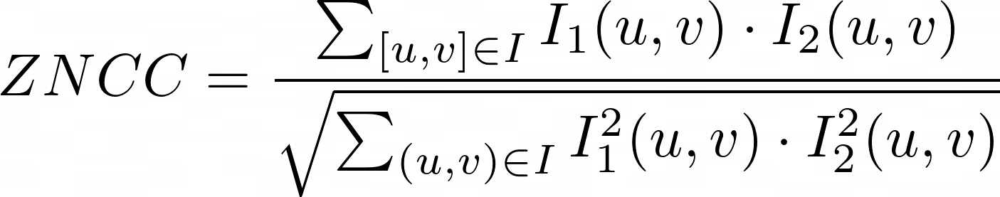

# Stereo

Stereo için farklı açıdan çekilmiş en az iki fotoğraf olmak kaydıyla 3D bilgilerin çıkarılmasıdır. Sahneyi farklı noktalardan çekerek elde edilen bilgileri karşılaştırarak 3D bilgiler elde edilebilir.

## Disparity
Farklı yerden çekilmiş iki fotoğrafta aynı noktaların farklı yerlerde olmasına `disparity` deniliyor.

Her bir noktanın diğer görüntüdeki dengini bulsak ve aralarındaki dengini çıkarsak noktayla arasındaki bulalım. Her pixel için elimize bir tane sayı geçecek. O sayıdan oluşan görüntü oluşturursam o zaman `disparity` resmini elde ederim. `Disparity`'de pixel ne kadar parlaksa o kadar yakındır.

`Disparity` görselinde sıfır olan yerler, diğer resimde orası görünmüyor. Yani `occlusion` var.

`Stereo`'da `occlusion` olacaktır. `Occlusion` ne kadar fazlaysa iş o kadar zordur.

Aynı noktadan çekilen fotoğraflarda `occlusion` hiç olmaz ancak o zamanda derinlik elde edilmez. Bu sebeple `occlusion`'u çözmemiz lazım.

1, 2, 3, 4 noktaları görüntüde aynı yere düşerç Teorik olarak sadece bir görüntüye bakarak bir noktanın derinliğini bulmak mümkün değil.

Gerçek dünyada p noktasının üzerinde düşecek sonsuz tane nokta var! Bu noktaların gerçek konumunu bulmak için başka noktadan bakmamız lazım.

# İşte Stereo!

Üçgenleme yöntemi ile çözüyoruz. Haritacılar bu işle çok uğraşıyorlar.

### Parallax:
İki gözün farklı görmesi ve `occlusion`'lar oluşturması.

### Vanishing Point:
Paralel giden paralellerin perspektifte birleştiği nokta.

## Julesz Random-Dot Experiment *(not complete)*
Cisimleri algılarken:
- Vanishing point
- Perspektif
- Cisimlerin büyüklüğü küçüklüğü
önemli ama iki görüntü arasında birbirine denk gelen noktaların denkleştirilmeside insan için önemli.

## STEREOGRAM

İki kamera arasında `Tx` kadar fark var.

`Stereo`'da `Tx`'e `baseline` diyoruz.

Diyelim sol kamera için `x1`, `y1` pozisyonuna düşüyor. Peki sağ kamera için?

Sağ kamera için

`y` ekseninde aynı kalır. `Baseline` nedeniyle değişen `x` olacak.

Bu şekilde kamerayı sağa kaydırmak yerine gerçek dünyadaki noktayı sola kaydırmış olduk. Eğer böyle yaparsak iki kamera birbirinin tıpatıp aynısı oluyor sadee birisi gerçek dünya ile konuşurken `-Tx` kadar çıkartmak gerekli.

Biz en başından beri `disparity` peşindeyiz.

Burada birbirine denk gelen noktada `y`'ler aynı `x`'ler farklı;

### Sol kamera

### Sağ kamera

### Stereo Disparity

> `Tx = baseline` iki kamera arasındaki uzaklık.

Bu eşitlik bir noktanın derinliği hakkında oluşuyor.

`d`'yi sıfıra götürelim sağ ve sol görüntü üzerinde nokta aynı yerde demektir. `d` sıfır olduğu zaman sonsuza gidiyor.

Bu seferde `d`'yi büyütelim. `d`'yi ne kadar büyütürsek `Z` o kadar küçülüyor. Kameranın dibine kadar geliyor.

`Tx` küçültelim; `Tx` sıfır olduğu zaman `d` ne oluyor?

`d` her zaman için sıfır olacak. `Tx` sıfır olduğu durumda derinlikten bahsedemeyiz. Derinlik için `Tx (baseline)` olması lazım, yoksa derinlik bulunmaz.

Mesela bazı hayvanlarda `central projection` aynı yerde, yani iki gözde de aynı yerde. Aynı yerde olunca derinliği bulamayız.

Eğer elde ettiğimiz görüntüleri birleştirip bir panoroma oluşturacaksak o zaman `Tx=0` olması lazım. Derinlikle alakalı yok. Derinlik olursa dikiş yapamıyoruz. Tam üst üste oturmuyor.

> Soru: `Y_right` ve `Y_left` arasındaki farkın sıfır çıkmasının sebebi nedir?

Sebebi kamerayı sadece x ekseninde hareket ettirdik.

Kamerayı y ekseninde de hareket ettirirsek orada da fark elde ederiz.

Bu farklılaşma sürekli olarak bir doğru üzerinde oluyor.

`P` noktasına denk gelebilecek tüm noktalar, sağ görüntüde bir doğru üzerinde olmalı.

Yani `x`, `y`'e değişebilir ancak `disparity` sadece bir doğru üzerinde oluyor. Bir doğru üzerindeki farklılaşma. Dolayısıyla `stereo`'da arama problemi tek boyutlu bir problem `P` noktasını sağ görüntü üzerinde ararken tüm görüntü üzerinde aramıyoruz, bir doğru üzerinde arıyoruz. Buna `epipolar constraint` deniliyor.

> Derinlik ve `stereo disparity` ters orantılıdır.

İnsanda `Tx` yaşlaşık `63mm` ve `Tx` değeri diğer değerlerle uyumlu ise sorun yok. 

Şimdi bir düşülelim. `f`'yi ihmal ettiğimizi varsayalım ve aşağıdaki gibi değerlerimiz olsun.

Örneğin:

d1=63/10 (6 pixel)

d2=63/60 (1 pixel)

d3=63/10,000

d4=63/15,000

`d3` ve `d4` yaklaşık 0 pixel!

`Z` ile `Tx` birbirine benzeyen sayılarsa stereo işe yarıyor. `Z` **çok büyük** sayılarsa işe yaramıyor.

Bu durumda insan 1.2 metre sonra çokta derinlik alamıyor. Peki insan derinlik algısını nasıl alıyor?
`Occlusion`'lardan alıyor, cisimlerin büyüklüklerinden alıyoruz, `vanishing point`'lerden alıyoruz.

# EPIPOLAR GEOMETRY

`P` noktasının yerini değiştirdiğimizde:

> Soru: `ep` ve `e'p'` doğruları yer değişecek ancak `e` ve `e'` değişmeyecek, neden?

Cevap: `Baseline` olduğu için sadece kameralar yer değiştirince değişir.

`O` ve `O'` kameralarımızın merkezleri
`e` ve `e'` epipoldür.
`l` ve `l'` ise epipolar lines.

`Transition` iki kamera arasındaki uzaklık.

İki kamera arasında `T` yani `transition` var ve `R` yani `rotation` var. Bu sebeple sadece `transition` değil `rotation`'u da işin içine koymamız gerekiyor.

 vektörünü  koordinat sistemi cinsinden açıklamak için elimdeki `p'`'nü rotate etmek gerekir.

![p.[tx (Rp')]](https://render.githubusercontent.com/render/math?math=p.[tx(Rp')])

Burada rotation matrisi 3x3 matrisdir.

> Hatırlatmak isterim ki 12 bilinmeyeni olan matrix `projection matrix` idi.

Rotation matrix içinde **9** sayı var ancak içerisinde **3** bilinmeyen var. x, y, ve z etrafında dönme.

`Rp'` ifadesinde, `R` 3x3 rotation matrix ve `p` ise 3'lük vektör.

> **Soru**: 3x3 matris ve 3'lük vectör çarpımı ne olur?
#### Cevap:
Yukarıdaki ifadeye bakacak olursak `Rp'` 3'lük vectör gelir. `t` ile `Rp'` kartezyen çarpımından 3'lük vectör gelir. Son olarak `p` 3'lük vectördür ve önceki ifade ile çarpımından dan gelen 3'lük vectör ile **dot product** yapılırsa sonuç *skaler* olur.

![p.[tx (Rp')]](https://render.githubusercontent.com/render/math?math=p.%5Btx%28Rp%27%29%5D=0)

Yukarıdaki ifadenin 0 olması gerekiyor.

Eğer birisi bize iki görüntü verip `t` ve `R` değerlerini de biliyorsak sonuç 0 olmalı.

> **Soru:** `p`, `t`, `R` değerlerini biliyoruz `p'` bulabilir miyiz?

Bunu matematiksel olarak düşündüğümüzde `p`, `t`, `R` verilmişse `p'` bulabilmemiz lazım. Yapacağımız tek şey onları çarpıp tersini alıp karşı tarafa geçirmek.

Ancak öyle bir şey olamaz `corresponding` problemini hiç resme bakmadan çözmüş gibi bir şey oluyoruz ancak resme bakmamız lazım.

Aslında bakılırsa matematiksel olarakta söylediğimiz çok doğru değil çünkü `p`, `t` ve `R` verildiğinde ve `p'` noktasını bulduğumuzda, bir nokta elde etmiyoruz elde ettiğimiz şey `p'` noktasının bulunduğu doğru denklemi geçiyor. Doğrudan `p'` noktasını bulamıyoruz.

Bu durumda `epipolar line` elde etmiş oluruz. `p` verilirse `p' epipolar line`, `p'` verilirse `p epipolar line` elde ederiz.
`Epipolar line` bildiğimizde onun üzerinde aramamızı yapabiliriz. Ancak tüm bunlar için `t` ve `R` nin bilinmesi lazım!

Bunu bir adım ileriye taşıyalım `t` ve `R` bize verilmese de biz bunu `t` ve `R` olmadan yapmaya çalışalım.

## Cartesian Product

Kartezyen product bu şekilde ancak biz böyle yapmak yerinde matrix şeklinde gösterebiliriz.

İşte `skew-symmetric` matrix. Bu işlemin sonucu bize vektör verecek.

![p.[tx (Rp')]](https://render.githubusercontent.com/render/math?math=p.%5Btx%28Rp%27%29%5D=0)

Aslında yukarıdaki ifadelerin ikiside aynı.

Burada `epsilon` şeklinde gösterilen `essential matrix`.

Skew-Symmetric matrisin nasıl yazıldığı aşağıda gösterilmiştir.

Öncelikle `epsilon` değerindeki `t`'yi `skew-symmetric` haline getirmemiz gerekiyor. Sonra `t`, 3x3 matris halini alır. `R`, 3x3 matris idi zaten. Bu durumda `epsilon` 3x3 matris olur.

Bu durumda yukarıdaki duruma getirdik matrisleri. Bunların hepsini çarparsak sonuç bir tane skaler olacak. Bunu da sırayla yapacak olursak;

işleminin sonucu `3x1` vektör. Sonra

işleminin sonucu ise `skaler` olacaktır.

## Essential Matrix

İçerisinde 9 tane sayı var ve o sayılar `R` ve `t` çarpımından oluşuyor. Bunu kamera kalibrasyonunda kullanabiliriz ama `epsilon` matrisi nasıl buluruz?

> **Bir düşünün:** Elimizde 9 tane denklem var `p` ve `p'` nü nasıl buluruz?

> Onları bilebilecek görüntüler çekebiliriz. Örneğin bomboş resim ortasında bir tane siyah nokta var. İki resimde de siyah noktanın resmin ortasına geldiğini biliyoruz bu sebeple `p` ve `p'` buluruz.

İki resim çektik bu bize `p` ve `p'` bilinir ancak `epsilon` değerinin hala bilmiyoruz. İlk çekilen resimler bize sadece bir tane eşitlik verdi. Ortasında nokta olan o sahneyi sağa sola götürerek istediğimiz kadar denklem elde ederiz. Her çektiğimiz resim bize `epsilon` içindeki sayılar hakkında bilgi veriyor. O bilgileri yeteri kadar toplayıp alt alta koyduğumuz zaman o 9 tane noktayı bulabiliriz.

İki tane kamerayı ayrı ayrı kalibrasyonunu yapmadan doğrudan `essential matrisi` buldum. `essential matrisi` bulduktan sonra `epipolar geometriyi` çözmüş olduk.

Buda demek oluyorki yeni bir sahnede çektim fotoğrafı iki tane görüntü var elimde, bir tane noktayı seçtim, seçtiğim noktaya denk gelen `epipolar line` nerede ise formülde yerlerine koyduk aramamızı o doğru üzerinde yapabiliriz.

`Essential matrisi` bir sayı ile çarpalım yine `essential matrix` olur çünkü bulduğumuz `epsilon` matrisindeki 9 sayı, `unique` 9 tane sayı değil. benim sistemimin başka `essential matris`leride var ve onların hepsi birbirine denktir. Aralarındaki farklılık bir scaler olabilir, neden?

her iki tarafı `alpha` ile çarparsak değişmez, bir `skaler` ile bağlıdır.

`R` içeriside 9 tane sayı var `t` içerisinde de 3 tane sayı var ama `t` için önemli olan vektörün yönü, nerede bağladığı nerede bittiği önemli değil. Vektörün yönünüde iki tane sayı ile ifade edebilirim. Bu durumda `essential matris`de `3+2=5` tane sayı var.

 bir doğru formülü `p'` noktasının sol resim üzeride gelebileceğin yerlerin doğrusu. Tersi yani 'de doğru benzer şekilde `p'` üzerinde gelebileceği yerlerin doğrusu.

Buradaki meseleyi tekrar edecek olursak. Aynı düzlem üzerindeki iki vektörü `cross product` yaparsak o düzleme dik başka bir vektör elde ederiz.

 burada 
 
ifadesinden 
 
elde edilir. 
 ise  vektörünü , vektörüne dik. İfade , bu hale geldi  vektörü  vektörüne dik olduğunu söylemiştim `dot product` yaptığımızda 0 olmalı. İşin matematiğini basitçe ele aldıktan sora yapmaya çalıştığımız `p` verildiğinde `p'` üzerinde yer aldığı doğru parçalarını bulabilelim.

^{T}\epsilon%20K'p'=0)

> **Soru:** Bu noktada ^{T}) nedir?

q^T=B^TA^T)

olduğundan

buradan ...

`K` sol kamera için `intristic` parametreler matrisi. `K'` sağ kamera için `intristic` parametreler matrisi.

Buradaki `F` fundamental matris.

yani  olmalı.

`Essential` matris gerçek dünyadaki koordinatlarda çalışıyor ancak `fundamental` matrix image koordinatlarında çalışıyor ve bizim buna erişimimiz var.

- Fundamental matrix **3x3** boyutlu bir matrix.
- Essential matrisin rankı **2**.
- Essential matrisin içerisinde **5** tane sayı var. 
- Fundamental matrisin içerisinde **7** tane sayı var. 

Buradaki `fundamental` matrisin rankı **3** olsaydı bunu çözebilirdik ancak rankı **2**.

> *Hatırlatma: `Fx` çözdüğümüzde `epipolar lines` gelecek.*

> *Hatırlatma: Bir doğru üzerinde noktaları aldığımızda `F` hesaplayamayız.*

## WEAK CALIBRATION

Eğer sol görüntünün, sağ görüntüye denk geldiğini biliyorsam ve elimde bunun gibi alt alta **9** tane eşitlik varsa burada `F` matrisini buluruz.

`F` matrix rank **2** olduğu için **9** tane sayıya gerek yok. **8** tane sayıylada bulabiliriz çünkü rank **3** değil.

biz bunun gibi alt alta 9 tane matrix getirirsek sonuç:

![](https://render.githubusercontent.com/render/math?math=%5Cbegin%7Bbmatrix%7D%0Au_1u%27_1%20%26%20u_1v%27_1%2C%20u_1%2C%20v_1u%27_1%2C%20v_1v%27_1%2C%20v_1%2C%20u_1%2C%20v_1%5C%5C%0Au_2u%27_2%20%26%20u_2v%27_2%2C%20u_2%2C%20v_2u%27_2%2C%20v_2v%27_2%2C%20v_2%2C%20u_2%2C%20v_2%5C%5C%0Au_3u%27_3%20%26%20u_3v%27_3%2C%20u_3%2C%20v_3u%27_3%2C%20v_3v%27_3%2C%20v_3%2C%20u_3%2C%20v_3%5C%5C%0Au_4u%27_4%20%26%20u_4v%27_4%2C%20u_4%2C%20v_4u%27_4%2C%20v_4v%27_4%2C%20v_4%2C%20u_4%2C%20v_4%5C%5C%0Au_5u%27_5%20%26%20u_5v%27_5%2C%20u_5%2C%20v_5u%27_5%2C%20v_5v%27_5%2C%20v_5%2C%20u_5%2C%20v_5%5C%5C%0Au_6u%27_6%20%26%20u_6v%27_6%2C%20u_6%2C%20v_6u%27_6%2C%20v_6v%27_6%2C%20v_6%2C%20u_6%2C%20v_6%5C%5C%0Au_7u%27_7%20%26%20u_7v%27_7%2C%20u_7%2C%20v_7u%27_7%2C%20v_7v%27_7%2C%20v_7%2C%20u_7%2C%20v_7%5C%5C%0Au_8u%27_8%20%26%20u_8v%27_8%2C%20u_8%2C%20v_8u%27_8%2C%20v_8v%27_8%2C%20v_8%2C%20u_8%2C%20v_8%0A%5Cend%7Bbmatrix%7D%0A%5Cbegin%7Bbmatrix%7D%0AF_%7B11%7D%5C%5C%0AF_%7B12%7D%5C%5C%0AF_%7B13%7D%5C%5C%0AF_%7B21%7D%5C%5C%0AF_%7B22%7D%5C%5C%0AF_%7B23%7D%5C%5C%0AF_%7B31%7D%5C%5C%0AF_%7B32%7D%5C%5C%0AF_%7B33%7D%5C%5C%0A%5Cend%7Bbmatrix%7D%0A%3D-%0A%5Cbegin%7Bbmatrix%7D%0A1%5C%5C%0A1%5C%5C%0A1%5C%5C%0A1%5C%5C%0A1%5C%5C%0A1%5C%5C%0A1%5C%5C%0A1%5C%5C%0A%5Cend%7Bbmatrix%7D)

Yukarı 9 tane sayı olmasına rağmen 8 tane denklemle çözebiliriz çünkü `epsilon` matrix gibi 
`F` matriside `up-to-scale` tanımlı yani **9** tane `unique` sayı değil, **8** tane tanımlı.

Biz tüm sayıları **9**'a bölersek **9.** sayı **1** olur ancak yinede `fundamental` matrix olur. Yukarıdaki **8** denklemi oluşturmak için 8 tane `corresponse` bilmek gerekiyor.

> Dikkat edilece nokta eğer `corresponse`'lar aynı doğru üzerinde ise `fundamental` matrisler doğru çıkmıyor çünkü değişik derinliklerden ve değişik düzlemlerden farklı noktalar vermek lazım ki yeteri kadar elimizde bilgi olsun.

## Rectification

Öyle iki tane `sanal kamera`m olsaydı ki bunların görüntü düzlemleri birbirine paralel olsun ve bu `sanal kamera`lar arasında `epipolar line`lar oluşturmaya çalıştığım zaman o doğrular birbirine parallel gelip aynı satıra denk gelsin.

`Central projection` ile `sanal kamera`yı kestiği yere noktayı koyuyoruz. Bunu teker teker uyguluyoruz. Bu `sanal kamera`ların ürettiği görüntüler kendisinden `rectified`.

`Rectification` yaptığımızda `corresponse` bulmak çok kolaylaşıyor. Doğru çizmekle, `F` ile uğraşmak zorunda kalmıyoruz.

Sanal iki görüntünüm varmış gibi düşünüyoruz. Tek yaptığımız şey bu iki görüntünün hesaplanması. Hesaplandıktan sonra `corresponse` problemi (çünkü zor olan o) çözmek daha kolaylaşıyor.

## A Simple Stereo System

- `X_left` ve `X_right` arasındaki fark `disparity`.
- `O_left` ve `O_right` aras `T` yani `baseline`.
- `Central projection` ile görüntü düzlemi arasındaki uzaklık `odak uzaklığı`.

Burada amacımız `Z`'yi bulmak `Z`'yi bulmak için üçgenlerin benzerliğini kullanarak çözeriz.

}=\frac{Z}{z-f})

Eğer `disparity` büyük olursa `Z` küçük olur. Bunu şöyle örneklendirebiliriz. İşaret parmağımızı 4-5 cm gözlerimizin önüne getiririz. Sağ gözümüzü kapatıp sol gözümüzle bakarız sonrada tam tersi şekilde yaparız ve parmağımızın çok yer değiştirdiğini göreceğiz işte bu durum `disparity`'nin fazla olmasıdır. Benzer şekilde aynı şeyi uzaktaki cisimlere uyguladığımızda ise cisimler az yer değiştirir.

Burada `T` ve `f` sabit. `T`'yi değiştirmeyi deneyelim. `T`'nin değişmesi için kameraların yaklaştırılıp uzaklaştırmam lazım.

`T`'yi **0** yapmak iki kamerayı *tek kamera* yapmak demek. Aynı kamerayla iki farklı zamanda fotoğraf çekmek demek. Peki bu mümkün mü?

Buradaki mesele `baseline`! `Baseline` yok olduğu zaman formül **işlevsiz**.

Açı düşük bir açı ise gözler paralelleşiyorç Göz çok uzağa *focus* oluyor. Göz yakına *focus* olmak için açının büyümesi gerek, açı büyüyünce gözler kendilerini iyi gererek yakına *focus* oluyor. VR gözlüklerinde açık çok büyük ancak objeyi çok yakında görüyoruz bu durum insanın kafasını karıştırıyor ve mide bulantısı gibi durumlar ortaya çıkıyor.

### Baseline yakın mı olmalı uzak mı?

Birbirine yaklaştırdığımıza `hassasiyet` artar.

bu durumda `T` küçülür. `T` küçük olduğu zaman `d`'deki ufak yanılma `Z`'yi çok kötü bir şekilde etkiliyor. `T` yeteri kadar büyükse `d`'deki bir iki pixellik yanılma bizi o kadar etkilemez. Dolayısıyla kameraları olabildiği kadar uzak yapmalıyız.

### Özetle:
> `Baseline` yakınsa, `FOV` artar.\
Sorun *hesaplama problemi* ve *`T`'ye çok bağımlı* olmam.

> `Baseline` uzaksa, `FOV` artar.\
Sorun ise *az yerin görülmesi*

Güzel çözümlerden bir tanesi `baseline` uzaklaştır ancak kameraları birbirine doğru çevirmek. Aynı insan gözü gibi. Ancak buradaki problem kameraları birbirinden ne kadar uzaklaştırırsam **görüntülerin birbirlerinden görünüşü** o kadar **farklı** oluyor.

1. ``Corresponse` bulmak çok zor oluyor. Örneğin bir küpe baktığımızı düşünelim. Kameralar çok uzak olduğunda her iki kamera kübün **farklı yanlarını** görebilir bu şekilde `correnponse` kurmak **imkansız**.
2. `Işıklandırma` **farkından** dolayı görüntüler **çok çok farklı** olmaya başlıyor

## Reconstruction

> Neden construction yerine reconstruction deniliyor?

Objenin her bir noktasının x ve y'si var ancak z'yi bilmiyoruz. Objeyi 3D dünyada **yeniden oluşturma** ediyoruz. Computer Vision dünyasında bu tabir çok kullanılınır. 

> **Reconstract**: *2D dünyadaki bilgilerden yola çıkarak, 3D obje hakkında bilgi edinmektir.

Bunu;
- Stereo, 
- Motion, 
- Gölgelendirme
- Focus
- Bulanıklıktan

etc. yapabiliriz.

### imgae

Gerçek dünyada `Q` noktası var. `Q` noktasının görüntüsü, sol görüntüde `q` noktasına ve sağ görüntüde `q'` noktalarına düşer. Sağ ve sol görüntüler arasında denklik sağlarken 1px kadar hata yapabiliriz. Bizi bu hata yapmaya zorlayan şeyler kamera kalibrasyonu ve görüntüdeki `noise`. Şöyle düşünelim yarım pixellik hatada da doğrular birleşmeyecek özellikle nokta çok uzakta ise. Zaten denkleştirme algorithmaları o kadar mükemmel çalışmıyor hata yapabiliyor. `R=Op` doğrusu ve `R'=O'p'` doğrusu kesişmesi gerekirken kesişmiyorlar çünkü 3D dünyada doğrular kesişmek zorunda değil. Bu iki doğrunun kesişmesi lazım ki kesiştirip gerçken dünyadaki `(x,y,z)` noktalarını bulalım. Bu durumda `R` ve `R'` birbirine bağlayacak en kısa doğruyu bulduğumuzda, bu doğrunun ortası `P` noktası olacaktır. `R` ve `R'` doğrularını birbirine bağlayacak en kısa doğru, `R` ve `R'` doğrularına dik olman doğrudur. `R` ve `R'` doğrularını bağlayan en kısa doğruyu bulmak için `R` ve `R'` vektörlerini `cross product (RxR')` yaparsam, `R` ve `R'` doğrularına **dik** yeni bir vectör elde ederiz. Sonuç olarak `Z` noktası gerçek dünyada `(x,y,z)` noktasını ifade ediyor.

İki doğruyu kesiştirmek kolay değil çünkü 2D boyutlu dünyada tüm doğrular kesişmek zorunda. 2D dünyada paralellik var ancak homojen koordinat düzleminde paralel doğrularda kesişiyordu. 3D dünyada doğrular kesişmek zorunda değil.

Stereo'da en az iki kamera kullanılması sonnucu aynı sahneye aynı anda iki kamera farklı açılardan bakar. Multiview Geometry birden fazla açıyla sahneye bakmak demek.

### Reconstruction by Triangulation

Ol ve Or baseline
OlPl
OrPr
P

Şimdi
0P1
olmak üzere elimizdeki dört tane vectör var.

Bu durumda `a.P_left` != `b.P_right` burada `a` ve `b` katsayılarını ne seçersek seçelim kesişmeyeceklerdir. Dolayısı ile bu noktaları biraraya getiren, `P` noktasının da üzerinde bulunduğu doğruyu hesaba katmak gerekir. Tüm bunlara ek olarak `P_left` ile `P_right` farklı dünyalarda yaşamıyorlar ve aralarında transition vektörü ve rotation matrisi var.

Bu durumda

=T)

Açıklarsam

Bu şekilde 4 tane kenarı olan polygon oldu ve toplamları 0 olması lazım. Buradan `a,b` ve `c` olmak üzere 3 tane bilinmeyenimiz var ve 3 tane denklem elde edince bilinmeyenleri bulabileceğiz. 

## Algebraic Contruction

Yukarıdaki görsel de sol ve sağ kameralarınyla `p` noktasını bulmak için `P` noktasının ilgili kameranın matrisi (`M`) ile çarpmak yeterli çünkü kameranın tüm parametreleri var elimizde. Hatırlatmak gerekirse `M` matrisinin içerisinde 12 tane sayı vardı. Tüm bu denklemleri bir araya getirdikten sonra elimizde çözülmesi gereken bir lineer sistem oluyor ve çözdüğümüzde ise tek bilinmeyen olan `P` noktasını buluruz. Bu tekniğin güzel taraflarından birisi de üçüncü kamerayı eklediğimizde de çalışır. Stereoda sadece iki tane kamera kullanılmayabilinir ancak kamera sayısı en az iki tane olmalı.

Eğer `triangulation` yöntemiyle kıyaslarsak, `triangulation` yöntemi sadece iki kamerayla çalışıyor ancak `algebraic` yönteminde istediğimiz kadar kamera kullanabiliriz. Eğer ikiden fazla kamera varsa ve `triangulation` yöntemiyle çalışmak istiyorsak iki iki gruplayıp üretilen `P` noktalarının ortasını alıp sonuca ulaşabiliriz. Stereoda tek kamera ile derinlik bilgisi alınamadığından tek kamerayı bu değerlendirmenin içine bile almıyoruz.

Diyelim ki elimizde bir kamera var ve sahn sabit. Kamerayı sahnenin etrafında hareket ettiriyoruz ama kameranın hareket ettirdiğimiz noktanın yerini çok iyi biliyoruz. Bu durumda kamera her yer değiştirdiğinde yeni `extrinsic` parametreler oluşuyor ve onların ne olduklarını biliyoruz. Yani kameranın her bir pozisyonunda bize bir `M` matrisi verecek. Dolayısıyla kamerayı hareket ettirip onlarca yeni pozisyondan görüntü aldığım zamanda `reconstruction` yapabiliriz. `Reconstruction` yapabilmek için hangi noktanın hangi noktaya geldiğini bilmemizz gerekiyor.

> Soru: `p=MP` işleminde `P` içerisinde dört tane sayı olan bir vektör, `M` matrisi ise 4x3 olan bir matris ve `p` içerisinde üç tane elemanı olan bir vektör. Bu durumda neden çözemiyoruz x,y,z noktasını.

*Cevap: `P` homojen koordinat sisteminde yani dört boyutlu bir vektör ancak burada üç tane eşitlik var. Bu sebeple `P` noktasını bulamıyoruz sadece `P` noktasının üzerinde yer aldığı doğruyu bulabiliyoruz. `P` noktasını bulabilmek için ikinci, üçüncü veya daha fazla eşitliklere ihtiyacımız var.*

Bir başka çözüm yolu ise `M·P` işleminin sonucu bir vektör. `M·P` ile `p` vektörünü cross product yaparsak sıfır çıkması lazım. Cross product işleminin özelliklerinden bir tanesi bir vektörü kendisi ile cross product yaparsak sonuö sıfır olur. 

Yukarıda `p` vektörünü `skew-symmetric` hale getirerek 3x3 matris yaptık ve `M` ile çarpıp daha sonra `P` vektörü ile çarparsak sonunç sıfır yine olacaktır. Güzel tarafı `p` vektörünün `skew-symmetric` haliyle `M` matrisi bilinen, `P` ise bilinmeyendir. Bunu istediğimiz kadar alt alta getirip çözüp `P` noktasını bulabiliriz.

## Rectification

Görüntüleri rotate edip ki aynı `conjugated epipolar doğruları` diğer görüntü üzerinde aynı satır ve sütunda denk gelmiş olsun. Eğer görüntüyü bu hale getirirsek `p·F` yapıp diğer görüntü üzerinde doğru elde etmeye gerek kalmayacak çünkü `rectified` edilmiş görüntülerde aynı doğru üzerine aynı satır ve sütun olacak. Bunu `fundamental matris` bulunduktan sonra arama işlemini basitleştirmeye yarar.

İki kameradan görüntü aldık. Görüntülerden yola çıkarak öyle iki tane sanal görüntü oluşturalım ki, yeni oluşturduğumuz iki tane görüntünün `epipolar` doğruları birbirine paralel ve aynı satırda olsun. Zaten gerçek kameralardan bakıldığında `conjugated epipolar doğrular` birbirine paralel değil.

## Finding Correspondences

Öncelikle görüntü `rectified` edildiğinden tüm resme bakmak zorunda değiliz sadece ilgili doğru üzerinde arama yapmamız yeterli olacak. Düşünelin aksine pixel pixel karşılaştırmayacağız bölge bölge karşılaştıracağız. Sol görüntüdeki doğrunun üzerindeki pencereye denk gelen sağ görüntüdeki hangisidir sorusunun cevabının arayacağız. 

Bu pencereleri karşılaştırılan yöntemlerden bazıları:

Pencelere içindeki tüm pixelleri birbirinden çıkar ve farkın en büyük olduğunu seç. Ancak biraz karamsar bir algoritma. Benzerliğin çok olmasını farkın az olmasından anlıyor. İki pencere birbirinin tıpatıp aynısı ise sıfır çıkması lazım ancak bir pixelde hata varsa benzerlik az.

Sum of Absolute Differences `(SAD)`: İki pencere arasındaki tüm pixellerin değerlerini çıkar sonra topla. İki pencere birbirinin tıpa tıp aynısı ise sıfır çıkması gerekiyor. Ufak tefek farklılıklar varsa o farklılıkların toplamı yani.

Sum of Square Distances `SSD`: İki pencere arasındaki farkların karelerinin topluyoruz.

> Soru: Doğru üzerindeki en mükemmel bölgeyi arıyoruz. Eğer en mükemmel olan varsa `SSA` ve `SSD` yöntemleride bulucak. Peki bu algoritmaların farklılığı nedir? Düşünün.

Cevap: SAD farkın çok olmasına kızmıyor ancak SSD fark yükseldiği zaman çok kızıyor. SSD yöntemi genelde daha başarılı sonuçlar sağlıyor.

`Cross Correlation`: İki penceredeki pixeller bire bire çarpılıp toplanmasıyla elde ediliyor. Sonuç ne kadar büyük olursa benzerlik o kadar fazla oluyor.

Aşağıda SSD ile Cross Correlation arasındaki benzerliği inceleyelim.

`SSD` yöntemini açarsak, aslında `SSD` içerisinde her bir pixelin çarpımı (`cross-correlation`) var. Bu çarpım negatif olduğu için, `SSD` küçük olabilmesi için çarpımın büyük olması gerekmekte.

> `Dense Disparity`: Her bir pixele denklik durumuna göre büyüksün küçüksün atamaya deniliyor.

### Normalize Cross Correlation

İki vektör arasındaki uzaklığı hesaplarız veya iki vektörü dot product yaparız.

> Hatırlatma: İki vektör birbirine dik ise `dot product` yapınca sonuç sıfır olur. İki vektör aynı yönde ise olabildiği kadar büyük bir sayı verir. *Sonuç* olarak `dot product` iki vektör arasındaki *`kosinüs`* verir.

Bu yöntemde normalizasyon yapmak için her bir elemanı vektörün boyutna bölüyoruz sonra iki vektör arasında dot product yaparız. 
Sonuç 1.0 ise paraleldir, *0* ise birbirine dik, -1 ise vektörler olabildiğince birbirine zıt demektir.

En güzel sonuçları `normalize cross correlation` üretiyor ancak maliyetli. Ürettiği sonuçlar `+1` ve `-1` arasında çünkü `kosinüs` bu aralıkla değerler üretiyor. Normalizasyon yaptığı için **gürültüden** ve **parlaklık değişiminden** çok fazla etkilenmiyor. 

Dense disparity yönetimdeki bir başka problem ise aşağıda görüldüğü üzere flat bölgeleri flat olan çok fazla yerle eşleyecek olması.

## Feature-Based Methods

Her bir pixel için disparity bulmaya çalışmayıp sadece **özelleşmiş** noktalar için disparity bulma esasına dayanır. Sağ görüntüde ve sol görüntüde kenarları bulalım. Sol görüntüdeki bir kenar için sağ görüntüde ona en çok benzeyeni arayalım. İki kenarın benzerliği bulmak lazım. Biliyorum ki bir kenarın `magnitude` ve `açısı` var orada bulunabilir veya kenarın bulunduğu bölgedeki pixel değerlerine bakılabilir. Bir başka yaklaşım `corner`lara bakabiliriz.

`Feature-based` yaklaşımın `dense disparity` methoduna göre dezavantajı her bir pixel için `disparity` hesaplanmıyor. Ancak bu eğer robot navigasyonu yapacaksak gayet yeterli bir yaklaşım çünkü robot önündeki engele çarpmasın istiyoruz bu sebeple her bir nokta için `reconstruction` yapmaya gerek olmuyor böyle durumlar için.

## Multiscale Edge Match

1. Rectified olan görüntüleri `sigma1` < `sigma2` < `sigma3` < `sigma4` olan penceleri `convolution`a sokalım ve elimizde dört farklı görüntü olsun. Sigma büyüdükçe büyüt detaylar, sigmanın küçük olması ise küçük detaylar ile alakalıdır.
2. Her bir görüntüde `zero-crossing of the Laplacian` yöntemi ile edgelerin yerlerini bul.
3. Önce büyük ölçete olanları al ve bunları match et.
4. Önce genel yapıyı özelleştirip sonra özelleşmiş yapıyı eşleştirir.

## Ordering Constraint *(not complete)*

Aynı yüzeyindeki noktaların sıralamaları değişmiyor. 
